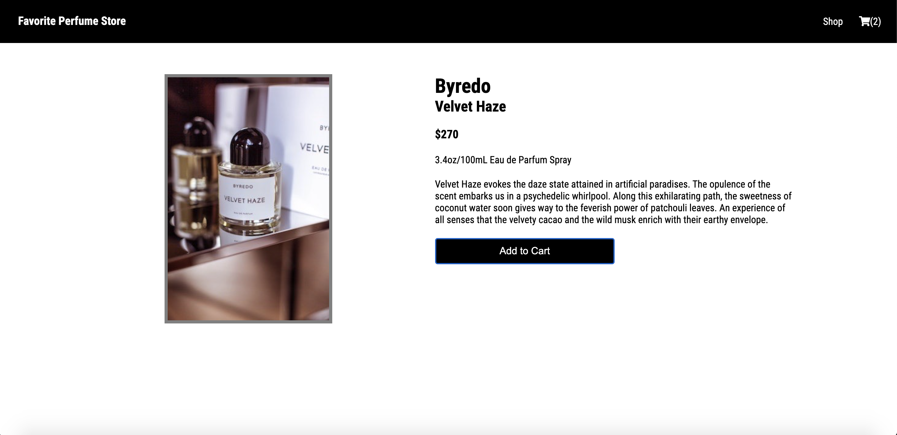

# Shopping Cart
_Favorite Perfume Store_ lets users add different perfumes to their shopping cart.  When the user checks their cart, they are able to modify the quantity of each perfume and view their total cost.  At checkout, they'll be alerted that checkout isn't available since it's a fictitious ecommerce website.  The project guidelines are listed in [The Odin Project](https://www.theodinproject.com/paths/full-stack-javascript/courses/javascript/lessons/shopping-cart) JavaScript curriculum.  Images were taken from [Unsplash](https://unsplash.com/).

[Live Demo](https://raych2.github.io/shopping-cart/#/)





## Purpose
The purpose of this project is to implement the use of React Hooks and routing with react-router-dom.  As I was building this project, I encountered issues with managing state and passing props between components. I solved that issue by utilizing Context API to give my components access to global state.

## Installation
In your terminal, clone this repository. Then, type the following:
```
cd shopping-cart
npm install
npm start
```

## Technologies Used
* HTML, CSS, JavaScript
* [React](https://reactjs.org/)
* [styled-components](https://styled-components.com/)
